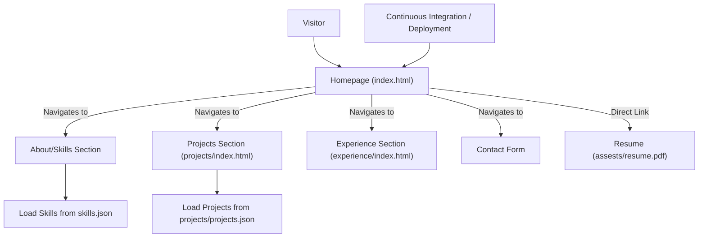

```markdown
# 🚀 Dynamic Developer Portfolio

<p align="center"></p>

## Short Description
The **Dynamic Developer Portfolio** is a sleek, modern, and highly interactive web presence meticulously crafted to showcase a developer's skills, projects, and professional experience. Designed with a focus on engaging visuals and seamless navigation, this portfolio converts a static resume into a captivating digital journey, enabling potential employers and collaborators to quickly understand your capabilities and achievements. Featuring dedicated sections for projects, experience, and skills, it's the ultimate platform for making a lasting impression.

## ✨ Key Features
*   **Interactive User Interface:** Engages visitors with dynamic elements and smooth transitions for a premium browsing experience.
*   **Comprehensive Project Showcase:** Dedicated section to highlight your key projects, potentially loading details from a structured JSON file for easy updates.
*   **Detailed Experience Timeline:** Presents your professional journey and achievements in an organized, easy-to-digest format.
*   **Skills Overview:** Clearly outlines your technical proficiencies using a data-driven approach.
*   **Downloadable Resume:** Provides quick access to your CV in PDF format (`assests/resume.pdf`).
*   **Automated Deployment (CI/CD):** Leverages GitHub Actions for streamlined and reliable continuous integration and deployment.
*   **Custom 404 Page:** Ensures a professional user experience even on broken links, guiding users back to relevant content.
*   **Responsive Design:** Optimized for a flawless display across various devices (implied by modern web development practices and comprehensive CSS).

## Who is this for?
This portfolio is ideal for:
*   **Software Developers & Engineers:** Looking to create a strong online presence and showcase their work.
*   **Freelancers:** Seeking to attract new clients with a professional and engaging display of their capabilities.
*   **Students & Graduates:** Aiming to impress recruiters with a modern, interactive resume alternative.
*   **Anyone** who wants a beautifully designed, easily maintainable personal website to highlight their professional journey.

## Technology Stack & Architecture
This project is built as a static website, prioritizing performance and simplicity while delivering a rich user experience.

*   **Frontend:**
    *   **HTML5:** For semantic content structuring.
    *   **CSS3:** For modern styling and animations, including a detailed `style.css` and dedicated styles for `404.css` and section-specific styles.
    *   **JavaScript:** Enhances interactivity, includes `app.js`, `script.js`, and `particles.min.js` for dynamic visual effects.
*   **Data Storage:**
    *   **JSON Files:** `projects/projects.json` and `skills.json` are used to store and dynamically load content, making updates straightforward without requiring a backend database.
*   **CI/CD:**
    *   **GitHub Actions:** Automates the testing and deployment process, as defined in `.github/workflows/ci-cd.yml`, ensuring consistent and fast updates.
*   **Deployment:**
    *   A static site, designed for easy deployment to platforms like GitHub Pages, Netlify, Vercel, or any web server.

## 📊 Architecture & Database Schema
This project functions primarily as a static site, meaning there's no traditional database schema. Instead, content is driven by structured JSON files. The architecture focuses on client-side rendering and navigation.



## ⚡ Quick Start Guide
Getting this portfolio up and running is incredibly simple:

1.  **Clone the Repository:**
    ```bash
    git clone https://github.com/mansibagwe26oss/portfolio_website.git
    cd portfolio_website
    ```
2.  **Open in Browser:**
    Simply open the `index.html` file directly in your web browser. There are no build steps required for local development.
    ```bash
    # For macOS/Linux (might open in default browser)
    open index.html
    # For Windows
    start index.html
    ```
3.  **Customize Content:**
    Edit `index.html`, `projects/projects.json`, `skills.json`, and the CSS/JS files in the `assests/` directory to personalize the content to your needs.

## 📜 License
This project is licensed under the terms found in the `LICENSE` file.
```